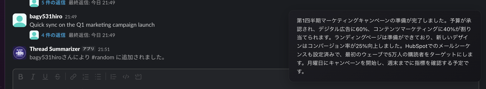
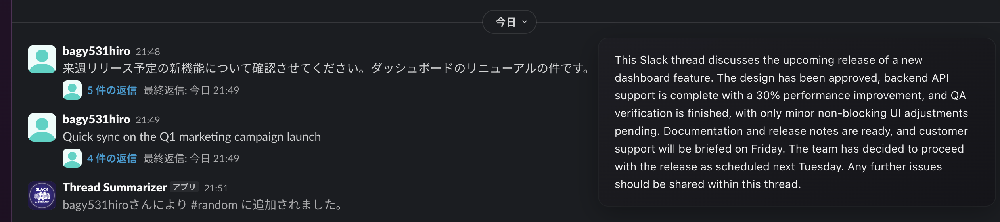

# Slack Thread Multilingual Summarizer (STM)

[](https://opensource.org/licenses/MIT)
[](https://github.com/haga0531/slack-hover/actions/workflows/test.yml)
[](https://nodejs.org/)

Summarize Slack threads in your preferred language with AI.

## Features

- Hover over any Slack message to see a summarize icon
- Click to get an AI-generated summary (3-5 sentences)
- Single message translation support
- Multi-language support: English, Japanese, Chinese, Korean, Spanish, French, German
- Privacy-focused: No one knows when you request a summary (unlike Slack's translation stamps)
- Workspace-shared cache for faster responses

## Usage

1. Hover over any Slack message to see the summarize icon
2. Click the icon to get an AI-generated summary in your preferred language

### Japanese Summary



### English Summary



## Security & Privacy

- **Workspace Isolation**: All cached data is strictly isolated by Slack workspace ID
- **No Raw Message Storage**: Only AI-generated summaries are cached, not original Slack messages
- **Anonymous Usage**: No tracking of who requests summaries
- **Slack API Validation**: Every request is validated through Slack's API
- **HTTPS Only**: All communications are encrypted
- **Auto-Expiry**: Server cache expires after 90 days, local cache after 30 days

## Architecture

```
slack-hover/
├── backend/          # TypeScript + Express backend
├── extension/        # Chrome extension (Manifest V3)
└── infrastructure/   # Terraform IaC
```

## Tech Stack

- **Backend**: TypeScript, Node.js, Slack Bolt
- **Hosting**: Google Cloud Run
- **LLM**: Vertex AI (Gemini)
- **Data Store**: Firestore
- **Browser Extension**: Chrome Extension (Manifest V3)
- **Infrastructure**: Terraform

## Getting Started

### Prerequisites

- Node.js 20+
- Google Cloud Project with:
  - Cloud Run
  - Vertex AI
  - Firestore
  - Secret Manager
- Slack App (create at api.slack.com)

### Backend Setup

1. Navigate to the backend directory:
   ```bash
   cd backend
   ```

2. Install dependencies:
   ```bash
   npm install
   ```

3. Copy environment variables:
   ```bash
   cp .env.example .env
   ```

4. Configure your `.env` file with:
   - Slack credentials (Client ID, Client Secret, Signing Secret)
   - GCP Project ID

5. Run in development mode:
   ```bash
   npm run dev
   ```

### Chrome Extension Setup

1. Open Chrome and go to `chrome://extensions/`
2. Enable "Developer mode"
3. Click "Load unpacked"
4. Select the `extension/` directory
5. Configure the API endpoint in extension options

### Slack App Configuration

1. Create a new Slack app at https://api.slack.com/apps
2. Add the following OAuth scopes:
   - `commands`
   - `chat:write`
   - `channels:history`
   - `groups:history`
   - `users:read`
3. Create a Slash Command: `/summarize`
4. Set the Request URL to your Cloud Run URL
5. Install the app to your workspace

## Deployment

### CI/CD (GitHub Actions)

Pushing to `main` branch automatically:
1. Runs tests (backend + extension)
2. Deploys to Cloud Run (if backend/ changed)

### Manual Deployment

```bash
cd backend
gcloud run deploy stm-backend \
  --source . \
  --region asia-northeast1 \
  --allow-unauthenticated
```

### Chrome Web Store

1. Create a ZIP of the extension directory
2. Upload to Chrome Web Store Developer Dashboard

## Infrastructure (Terraform)

GCP infrastructure is managed with Terraform.

### Setup

```bash
cd infrastructure
terraform init
```

### Preview Changes

```bash
terraform plan
```

### Apply Changes

```bash
terraform apply
```

### Managed Resources

- GCP APIs (Cloud Run, Firestore, Vertex AI, etc.)
- Firestore Database
- Cloud Run Service
- IAM Policies

## License

MIT
